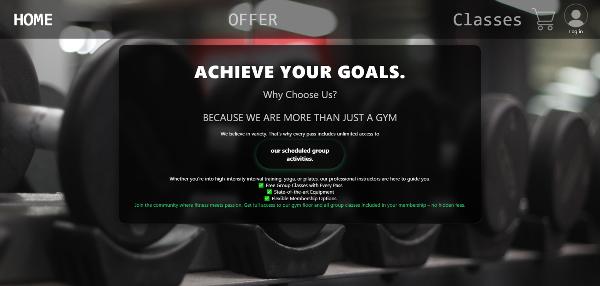
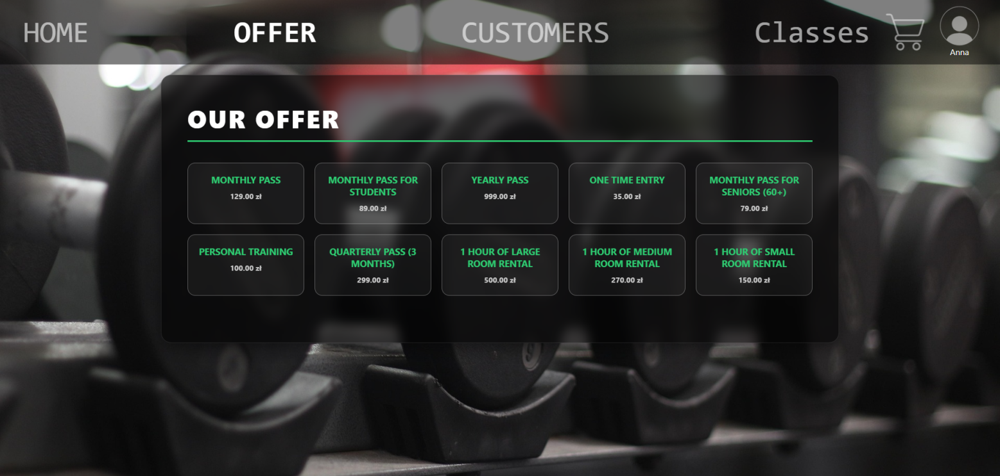
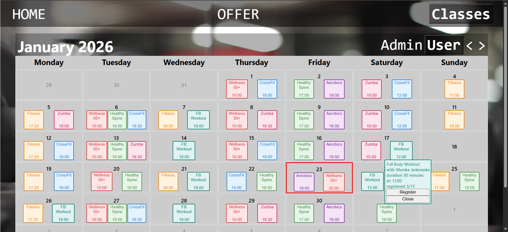
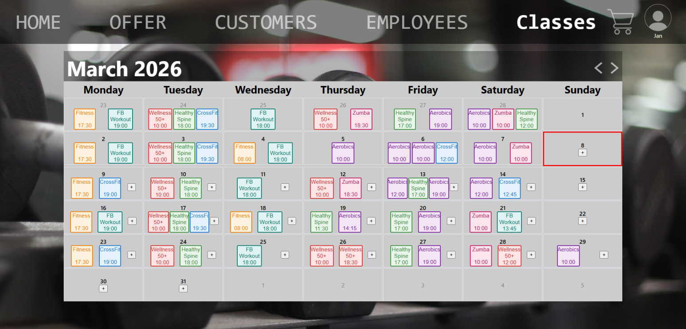

# 🏋️‍♂️ Build Your Dream Body - Gym Management System

> **Academic Project:** A full-stack application for managing a modern fitness club, combining a high-performance **SQL Server** backend with a custom **React.js** frontend.

## 📝 About the Project
This project goes beyond simple CRUD operations. The main goal was to implement complex business logic directly within the database engine to ensure data integrity and performance.

The system manages the entire workflow of a fitness club: from client registration and membership management to an interactive class schedule with real-time slot validation.

## 🛠 Tech Stack
* **Frontend:** React.js, Custom Hooks, CSS Modules (Glassmorphism & Neon UI).
* **Database:** Microsoft SQL Server (T-SQL).
* **Backend:** Node.js & Express (API Layer).

## 🧠 Key Technical Highlights (SQL Server)
Unlike standard web apps, logic is handled via **Database Objects**:

* ✅ **Advanced Triggers:**
    * **`UpdateRegisteredCount`**: Automatically prevents overbooking. If a user tries to join a full class, the transaction is rolled back.
    * **`GeneratePayment`**: Automatically creates financial records the moment a reservation is made.
    * **`MinorAlertMembership`**: Prevents the sale of memberships to minors without authorization.
* ✅ **Stored Procedures:** All API interactions are encapsulated in secure procedures to prevent SQL injection and abstract the schema.
* ✅ **Views:** Complex data aggregation (JOINs across 5+ tables) is handled via optimized Views for the Schedule and User History.

## ✨ Frontend Features
* **Custom Calendar:** Built from scratch (no external calendar libraries) with dynamic filtering.
* **Role-Based Access:** Distinct interfaces for **Clients** (booking, history) and **Admins/Trainers** (schedule management).
* **Modern UI:** A unique aesthetic featuring "Glassmorphism" effects and neon accents.

---

## 📸 Application Gallery

  <h3>📱 User Interface</h3>
  
    
  
    
  
    
  

    
  <h3>💾 Database Structure</h3>
  
    
  

---
## 🚀 Future Roadmap
The project is currently in **development**. Future plans include:
- [ ] **Extended UI Functionality:** Implementing frontend interfaces for the remaining stored procedures, including a dedicated **WorkShifts Calendar** for managers and comprehensive Customer/Employee management tabs.
- [ ] **Auth & Security:** Implementing secure login with **Role-Based Access Control (RBAC)** to enforce different permissions for Admins, Employees, and Customers.
- [ ] **Payment Gateway:** Integration with **Stripe/PayPal API** to replace the current SQL-based transaction simulation.
- [ ] **Mobile App:** Porting the client-side application to **React Native**.
